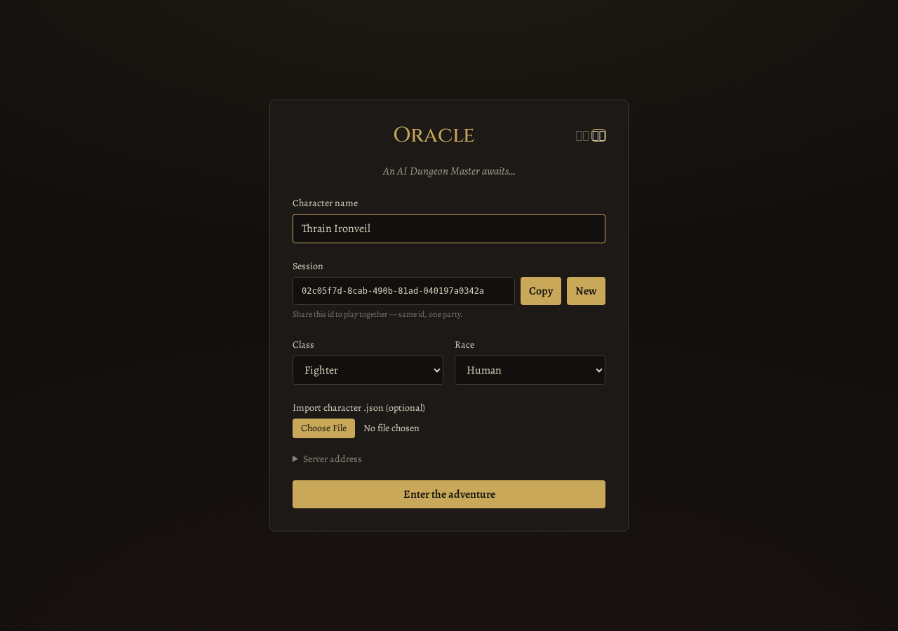
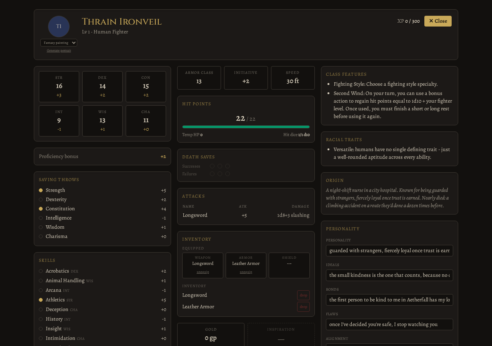
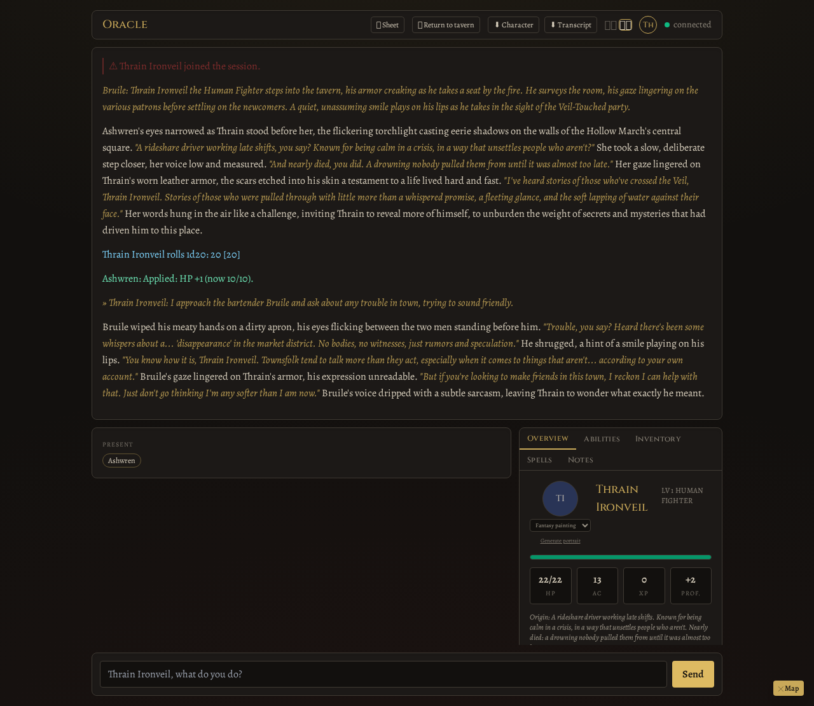

<p align="center">
  <a href="https://github.com/Cyb3rRon1n/oracle/actions/workflows/ci.yml"></a>
  <a href="LICENSE"></a>
  
</p>

<p align="center">
  
</p>

<p align="center">
  📖 <a href="ROADMAP.md">Roadmap</a> · <a href="docs/walkthrough.md">Setup walkthrough</a> · <a href="docs/protocol.md">Protocol</a> · <a href="docs/REBUILD_PLAN.md">v2 rebuild notes</a>
</p>

An AI Dungeon Master that runs a real-time tabletop RPG session in your browser — an LLM sitting in the GM seat, adjudicating rules, narrating the world, and managing campaign state.

A solo engineering project built around one central, unglamorous question: when you hand an LLM a real tool to change game state, how often does it actually use it, and why not? The [README status](#the-tool-call-reliability-investigation) and [ROADMAP.md](ROADMAP.md) log that investigation — including a live, reproducible tool-call reliability harness, real percentages across local models, and a genuine correctness bug the harness itself surfaced — rather than smoothing it into a simple "it works" claim.

## What makes it Oracle

Instead of a single-player chatbot, Oracle is a game engine with an LLM in the GM seat:

- **The server owns all truth.** Character sheets, world state, turn order, the campaign clock — every mechanical number is computed by the Python engine. The model narrates and adjudicates through tool calls (`update_character`, `update_world`, `request_roll`, `lookup_rule`); it never gets trusted with arithmetic.
- **Multiplayer, two ways**: players share one browser tab and take turns (hotseat), or open their own tabs/windows over the network — same WebSocket protocol underneath.
- **Two-phase turns** (v2): a schema-constrained *decide* call makes every structured decision — rolls, sheet deltas, world deltas, scene facts — then a separate unconstrained call writes the actual prose. Constrained JSON can't malform; unconstrained prose doesn't flatten. On the Ollama backend the decide phase runs under llama.cpp structured output; malformed tool calls are physically impossible, not merely discouraged.
- **Grounded in real rules**: the DM looks up official D&D 5e SRD data before improvising mechanics, and the engine computes real AC, spell-slot bookkeeping, ability modifiers, proficiency bonuses, disadvantage from tracked conditions, death saves, and initiative.
- **Real XP and leveling, awarded deterministically**: defeating a tracked NPC awards XP automatically from the SRD's Challenge Rating table when the engine observes its HP hit 0 — no dependence on the model reliably calling a dedicated tool.
- **Keyword-triggered lorebook** (v2, SillyTavern World Info pattern): drop campaign files into `world_context/`, toggle them per session, and only entries whose keywords appear in recent play get injected — under a hard character budget with priority eviction.
- **Campaign memory** (v2): a rolling summary rebuilt every ten resolved turns keeps early-session plot alive after the sliding history window scrolls past it.
- **Fact ledger** (v2): each turn the DM also records up to three short durable facts — promises made, debts, discoveries — deduped into a persistent per-session list injected back into later turns' context, newest-first with older facts resurfacing when named. A promise from turn 3 still reaches the DM on turn 40; no extra LLM calls spent capturing or recalling it.
- **Progress clocks** (v2): Blades-style segmented tension meters as server state, ticked by the DM via tool; filling one announces itself.
- **Structured scenes** (v2): each turn resolves into a `scene_update` — NPCs present, points of interest, up to four suggested actions rendered as clickable chips, each tagged with a skill and DC when it represents a real check (a BG3 dialogue-wheel feel: see the stakes before you commit).
- **Coordinate map** (v2): the DM places locations (with emoji hints) through its world-update tool; clients render the graph with the current location highlighted.
- **Multi-provider AI** (v2): Ollama (local), Anthropic, or any OpenAI-compatible endpoint (Deepseek, Kimi, Grok, OpenAI).
- **Character export/import** and transcript download, entirely client-side.
- **FR / EN interface**, switchable live from either screen.

## Running it

A session is two halves: a Python **server** (the engine + LLM narrator — the
source of truth for every mechanical number) and the **web client** (React, the
browser app you play in). The server runs on one machine; everyone else just
opens a browser at it. Below is the quick start — [docs/walkthrough.md](docs/walkthrough.md)
is the same thing step by step.

Requirements: Python 3.11+, Node 20+ (build only).

```bash
# ── server (one machine) ─────────────────────────────────────────────
pip install -e ".[ollama]"          # or ".[dev]" for API-only backends
cp .env.example .env                # set DM_BACKEND / keys
python -m server.main               # ws://localhost:8765

# ── web client (dev, hot reload) ─────────────────────────────────────
cd web && npm ci && npm run dev     # http://localhost:5173

# ── web client (production build) ────────────────────────────────────
cd web && npm run build && npm run preview
```

Open two browser windows/tabs pointed at the same session id and you're playing
together. Character `.json` exports from a previous session import on the join
screen.

### Playing from another machine

The server and the web client don't have to be on the same machine. The web
client only ever needs to reach `ws://<server>:8765`; who serves the page is
separate. Clients just need a browser — no clone, no Python, no install.

- **Server machine** — set `SERVER_HOST=0.0.0.0` in `.env` (the default
  `localhost` keeps it single-machine), note the machine's LAN IP (`ip -4 addr`
  / `ipconfig`), and open port 8765 if a firewall is on.
- **Clients** — point the web client at the server *before* it builds, since
  `VITE_SERVER_URI` is baked in at dev/build time (`web/src/config.js`):
  - dev: `VITE_SERVER_URI=ws://<server-ip>:8765 npm run dev -- --host`
  - production: `VITE_SERVER_URI=ws://<server-ip>:8765 npm run build`, then
    serve `web/dist/` (or `npm run preview -- --host`)
  - `--host` is what lets vite's dev/preview server answer browsers on *other*
    machines instead of only this one.
- Every player then opens `http://<server-ip>:5173` in their browser. Same
  session id in every window = same game; the server hosts any number of
  independent sessions side by side.

### Run as a Docker stack

`docker-compose.yml` brings up the server and the web client together, the
client served behind its own origin (nginx proxies the game websocket to the
server), so there is no server URL to type on the join screen.

```bash
cp .env.example .env                 # set DM_BACKEND and a key / Ollama host
docker compose up -d --build         # web client on http://localhost:8780

# local narrator instead of a hosted API:
docker compose --profile ollama up -d --build
docker compose exec ollama ollama pull qwen2.5:7b
#   ...and in .env:  DM_BACKEND=ollama   OLLAMA_HOST=http://ollama:11434
```

`WEB_PORT` (default `8780`) and `SERVER_PORT` (default `8765`) set the host
ports; sessions and pulled models persist in named volumes. For an NVIDIA
GPU, uncomment the `deploy:` block on the `ollama` service (needs the NVIDIA
Container Toolkit on the host — without it Ollama silently runs on CPU).

### Configuration

| Variable | Default | Purpose |
|---|---|---|
| `DM_BACKEND` | `anthropic` | `anthropic` \| `ollama` \| `openai` |
| `ANTHROPIC_API_KEY` | — | Anthropic backend |
| `OLLAMA_MODEL` / `OLLAMA_HOST` | `qwen2.5:7b` / localhost | Ollama backend |
| `OPENAI_BASE_URL` / `OPENAI_API_KEY` / `OPENAI_MODEL` | api.openai.com | Any `/chat/completions` provider |
| `WORLD_CONTEXT_DIR` | `world_context/` | Lorebook source files |
| `SESSION_STORE_DIR` | `sessions/` | Session persistence |
| `SERVER_HOST` / `SERVER_PORT` | `localhost` / `8765` | Server bind address/port — `SERVER_HOST=0.0.0.0` accepts clients from other machines (the Docker image sets this) |
| `WEB_PORT` | `8780` | Docker stack only — host port for the web client |
| `VITE_SERVER_URI` | build-time | `auto` = resolve the ws:// URL from the served page (Docker default); or a fixed `ws://host:8765` |
| `OLLAMA_TWO_PHASE` | `true` | `"0"` restores the single-call path (kept for A/B measurement) |
| `OLLAMA_FACT_LEDGER` | `false` | `"1"` opts the decide call into recording durable session facts (measured reliability cost on qwen2.5:7b — see CHANGELOG); hosted backends always have it |

## Repository layout

```
├── server/            # authoritative engine (this is the game)
│   ├── engine.py      #   turn loop, tools, broadcasts
│   ├── state.py       #   sheets, world, clocks, map, session
│   ├── narrator*.py   #   anthropic / ollama / openai-compatible backends
│   ├── lorebook.py    #   keyword-triggered context injection
│   ├── rules/srd.json #   D&D 5e SRD data
│   └── lore/          #   default campaign premise (Aetherfall)
├── shared/protocol.py #   event envelope + types (single source of truth)
├── web/               # React 18 + Vite + Tailwind client
│   └── src/
│       ├── state/store.jsx    # one reducer per protocol event
│       ├── lib/{ws,protocol,storage}.js
│       ├── i18n.jsx           # FR/EN
│       └── components/        # join, log, sheet tabs, scene, map, dice
├── tests/             # pytest: engine/state/narrators + live WS transport e2e
└── docs/              # protocol spec (incl. v2 additions), rebuild plan
```

## Screenshots

Real captures of the live app — join screen, a live character sheet with real computed stats, and an actual played turn (local Ollama backend): a real natural-20 roll, a real HP change applied to the sheet, real dialogue.

<p align="center">
  <br>
  <sub>Join screen — pick a class/race or import a character, share the session id to play together</sub>
</p>
<p align="center">
  <br>
  <sub>Every number on the sheet is computed by the server, not the model — the avatar, style picker, and Equipped/Inventory split are all live</sub>
</p>
<p align="center">
  <br>
  <sub>A real played turn — the natural 20 and the HP change are both genuine engine output, not staged</sub>
</p>

## The tool-call reliability investigation

The [ROADMAP](ROADMAP.md) documents a repeatable harness (`scripts/live_reliability_check.py`) measuring whether small local models actually fire `update_character` when narration demands it — baseline percentages across models, a two-request split tried and reverted, and what moved the needle (structured output roughly doubled real tool-call correctness). The v2 narrator changes (two-phase turns, lorebook injection, campaign summaries) change the prompt context those baselines were measured against; the post-v2 re-run is in CHANGELOG (two-phase decide phase measured; a silent decide-prompt bug fixed) — pre/post numbers remain separate eras.

## Contributing

Solo portfolio project — issues and ideas welcome via the issue templates; see [CONTRIBUTING.md](CONTRIBUTING.md) for PR expectations.

## License

[MIT](LICENSE)
