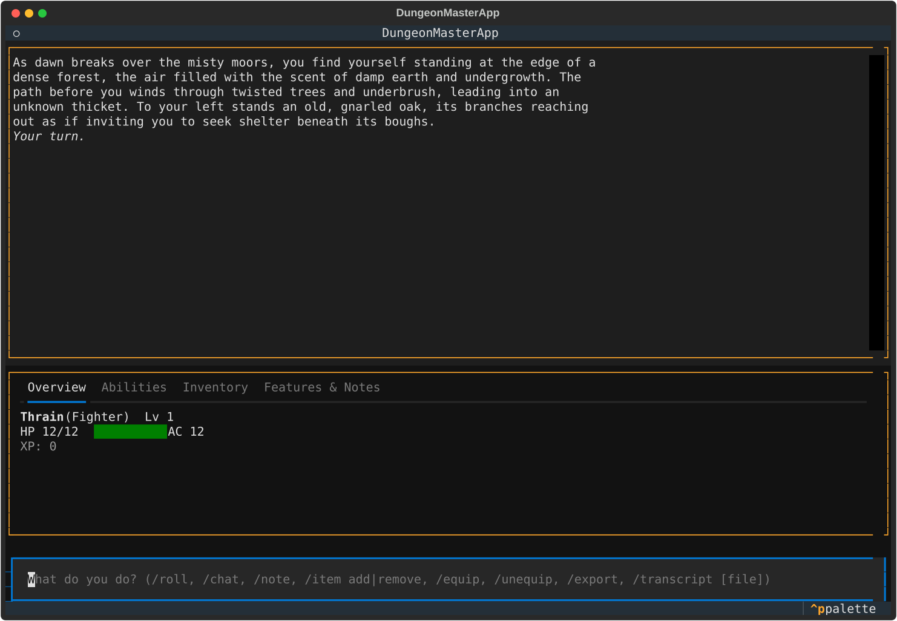
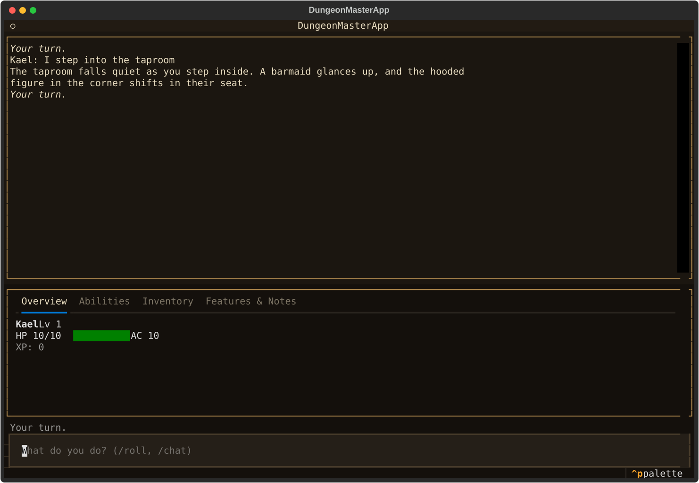
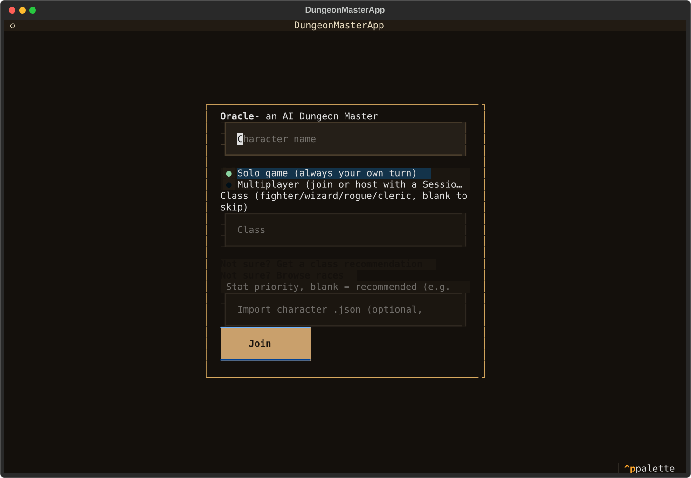
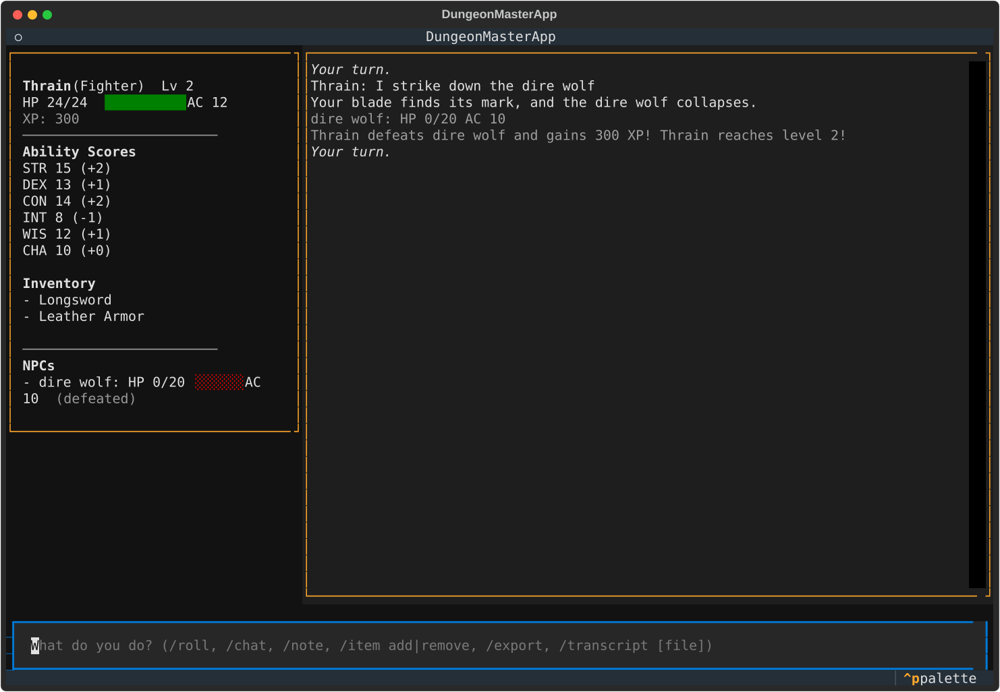

# Oracle

[](https://github.com/Cyb3rRon1n/oracle/actions/workflows/ci.yml)
[](LICENSE)
[](pyproject.toml)

An AI Dungeon Master that runs a real-time tabletop RPG session over a terminal UI — an LLM sitting in the GM seat, adjudicating rules, narrating the world, and managing campaign state.

A solo engineering project built around one central, unglamorous question: when you hand an LLM a real tool to change game state, how often does it actually use it, and why not? The [README status](#status) and [ROADMAP.md](ROADMAP.md) log that investigation — including a live, reproducible tool-call reliability harness, real percentages across two local models, a candidate fix that was tried and reverted after it didn't hold up under real-engine testing, and a genuine correctness bug the harness itself surfaced — rather than smoothing it into a simple "it works" claim.

## Screenshots

The first two are real captures from a live session — local `qwen2.5:7b` via Ollama, no mocked output. Left panel is the persistent character sheet; right panel is the scrolling narrative log.

**A fresh session's DM-generated opening scene:**



**After submitting a player action, mid-story:**



**The welcome screen's character-import field** — real UI, no DM/narration involved at all:



**A real level-up** — the engine-driven XP award and HP growth are exactly what a live model would trigger too; only the narration line ("Your blade finds its mark...") is a scripted stand-in, since this dev environment has no live Ollama/Anthropic access to capture from (see [ROADMAP.md](ROADMAP.md)):



`scripts/generate_screenshots.py` (`python -m scripts.generate_screenshots`) regenerates the two non-live screenshots above after a TUI change — it does not and cannot touch the two live-Ollama captures, which need a real model session to recapture honestly.

## Concept

Instead of a single-player chatbot, Oracle is a game engine with an LLM in the GM seat:

- **Multiplayer, two ways**: players share one terminal and take turns (hotseat), or connect from their own terminals over the network — same engine underneath, different transport. Networked play with 2+ real clients trading turns, presence, and chat has been verified live end-to-end (see [ROADMAP.md](ROADMAP.md)); hotseat mode is architecturally supported but not separately exercised.
- **Persistent character view**: each player's client always shows two regions — their character sheet, and a scrolling log of turn actions, DM narration, and prompts.
- **LLM as adjudicator/narrator**: the server owns the source of truth (character sheets, world state, turn order, session log) and calls the LLM to resolve actions and narrate outcomes.
- **Grounded in real rules, not just vibes**: the DM can look up official D&D 5e SRD data (monster stats, spells, conditions) before improvising mechanics, and can reach for general web search when it needs outside inspiration.
- **Real D&D-style XP and leveling, awarded deterministically**: defeating a tracked NPC/monster awards real XP (automatically, from the SRD's own Challenge Rating table, whenever the NPC's name matches a known monster) and levels a character up against the SRD's real Character Advancement thresholds — the award itself is triggered by the engine observing an NPC's HP hit 0, not by depending on the DM model reliably calling a dedicated tool, so it works the same regardless of which model is narrating.
- **Character export/import**: `/export` saves your full character (progression included — XP, level, inventory, notes) to a local file at any point; import it back in on a future Join to pick up exactly where you left off, instead of losing progress once a session ends.
- **Real ability scores (STR/DEX/CON/INT/WIS/CHA)**, assigned deterministically from the SRD's own real Standard Array per class, driving real HP growth (a genuine CON modifier, not just a flat hit-die roll) and real modifiers on DM-requested rolls — the engine computes and applies the modifier itself rather than trusting the model to do that arithmetic correctly.

## Planned (later)

- Image generation for scene/character art, triggered off narration beats.
- Text-to-speech for DM narration, for a more immersive session.

The narrator sits behind a swappable interface from the start (see Architecture below) specifically so these can slot in without restructuring the engine.

## Architecture

- **Engine/server** (`server/`): owns game state (character sheets, world/campaign state, turn order, session log), enforces a strict turn queue, and calls the LLM for rule adjudication and narration.
- **Narrator** (`server/narrator.py`): the LLM call sits behind a `NarratorBackend` interface, selected via `DM_BACKEND`. Two implementations exist:
  - `AnthropicNarrator` (`DM_BACKEND=anthropic`) — hosted Claude, streams narration and can call five tools mid-turn: `request_roll` to resolve a genuinely uncertain action (dice notation plus an optional DC, returning a real result and success/failure verdict to narrate against — rolls aren't just decorative), a local `lookup_rule` tool backed by a small SRD dataset (`server/rules/`, CC-BY-4.0-licensed — see `server/rules/ATTRIBUTION.md`), `update_character` to apply real HP/inventory/condition changes to the acting character's sheet *or a named NPC/monster's own tracked sheet* (and give it a persistent memory note), `update_world` to track the campaign's persistent objectives/plot threads/location beyond any single scene, and Anthropic's hosted `web_search` for general inspiration only.
  - `OllamaNarrator` (`server/narrator_ollama.py`, `DM_BACKEND=ollama`) — a free, local backend against a running [Ollama](https://ollama.com) server. Same `lookup_rule`/`update_character` tools (including the NPC-memory note); no `web_search` (Anthropic-hosted, no local equivalent) and, for now, neither `request_roll` nor `update_world` — deliberately withheld, not just weaker, since live testing found local models already miss the existing tools on most clearly-warranted turns (see Status below).
- **Persistence** (`server/persistence.py`): session state is saved to disk via a swappable `SessionStore`, same pattern as the narrator.
- **Clients** (`client/`, Textual TUI): thin — render the character sheet pane (including level, XP, and active objectives) + narrative/input log, send player actions to the engine. Hotseat and networked play are the same client/engine pair with different transports (local I/O vs. sockets).
- **Protocol** (`docs/protocol.md`): the client/server event contract — this and the networked-from-day-one split exist so multiplayer, image generation, and TTS can be added later without a rewrite.

## Tech stack

- **Python** + **[Textual](https://textual.textualize.io/)** for the terminal UI.
- **[websockets](https://websockets.readthedocs.io/)** for the client/server transport.
- **[Anthropic Claude](https://www.anthropic.com/claude)** (`claude-sonnet-5`) or a local **[Ollama](https://ollama.com)** model as the narrator, with tool use for grounded rules lookups and real character-state changes.

## Running

A full session is two long-running programs talking to each other over a local network connection — the **server** (the game engine + DM) and the **client** (the terminal UI you actually type into). You'll need two separate terminal windows/tabs open at the same time: one stays running the server the whole session, the other runs the client you interact with. Closing either one ends that half of the session; the server can keep running with nobody connected, and you can reconnect a client to it later.

### 0. Before you start

You need:

- **Python 3.11 or newer** already installed (check with `python3 --version`).
- A terminal you're comfortable opening two windows/tabs of.
- Either a free [Ollama](https://ollama.com) install (no account, no cost, runs the AI locally on your own machine — slower, see the note below) **or** an [Anthropic API key](https://console.anthropic.com/) with billing set up (faster, hosted, costs real money per session). You only need one of these, not both.

### 1. Get the code and set up a virtual environment

If you haven't already cloned it:

```bash
git clone https://github.com/Cyb3rRon1n/oracle.git
cd oracle
```

A [virtual environment](https://docs.python.org/3/library/venv.html) keeps this project's Python packages separate from everything else on your system — create and activate one:

```bash
python3 -m venv .venv
source .venv/bin/activate   # on Windows: .venv\Scripts\activate
```

You'll know it worked if your terminal prompt now starts with `(.venv)`. You'll need to run that `source`/`activate` line again any time you open a new terminal to work in this project.

### 2. Choose how the DM will think, and install accordingly

**Option A — Ollama (free, runs on your own computer, recommended for just trying it out):**

```bash
pip install -e ".[ollama]"
```

Then, separately, install Ollama itself from [ollama.com](https://ollama.com) if you don't have it yet, and pull the model Oracle defaults to:

```bash
ollama pull qwen2.5:7b
```

**Option B — Anthropic Claude (hosted, needs a paid API key):**

```bash
pip install -e .
```

You'll need an `ANTHROPIC_API_KEY` from [console.anthropic.com](https://console.anthropic.com/) with billing/credits set up — Oracle never generates or stores this key for you, you provide your own.

### 3. Configure

```bash
cp .env.example .env
```

Then open the new `.env` file in any text editor and fill in the one or two lines that matter for the option you picked in step 2:

- **Ollama**: set `DM_BACKEND=ollama`. `OLLAMA_MODEL` already defaults to `qwen2.5:7b`, matching what you pulled above — leave it as-is unless you want to try a different model.
- **Anthropic**: set `DM_BACKEND=anthropic` and put your real key on the `ANTHROPIC_API_KEY=` line.

Everything else in `.env` (`SESSION_ID`, `SESSION_STORE_DIR`) can stay at its default for a first run.

### 4. Start it — two terminals

**Terminal 1** — start the server and leave it running (this is the game engine; it won't print much beyond a startup line, that's normal):

```bash
python -m server.main
```

**Terminal 2** — start the client, which is what you'll actually see and type into:

```bash
python -m client.main
```

A full-screen terminal interface opens straight into a welcome screen — your pre-game menu:

- **Character name** and **Session ID** (blank for default) — plain text fields.
- **Class** (`fighter`/`wizard`/`rogue`/`cleric`, blank to skip) — only shown for a brand-new character, not on reconnect. Picks a real starting HP (from the class's SRD hit die) and a starting item or two, so your sheet isn't just a name and 10 HP with nothing else. Leave it blank for that old blank-sheet behavior instead.
- **Import character .json** (optional, also brand-new-character only) — path to a file previously written by `/export` (see Play, below). When filled in, it wins over the name/class fields above entirely — your saved name, class, HP, XP, level, inventory, and notes all carry over, picking up your progression instead of starting fresh.

Press **Join** (or Enter) and you land in the **lobby**: your character sheet on the left (review it before things kick off), a chat log on the right, and a **Start Adventure** button. This is where you can chat with anyone else who's joined, and see them show up in the **Party** list on your sheet, before anything happens in the story. Any joined player can hit Start Adventure — there's no separate host — and everyone's client moves into the real session view together, where the DM narrates the opening scene live.

Reconnecting mid-game (the client remembers you via `.player_id`, see below) skips the lobby entirely and drops you straight back into the session.

### 5. Play

Once the adventure starts, the interface is your character sheet on one side, a scrolling narrative log on the other, and an input bar at the bottom. The DM opens with a short scene as everyone watches it stream in — no blank prompt to stare at. From there, type what your character does in plain English and press Enter — e.g. `I open the door` or `I attack the goblin with my sword`. The DM (Ollama or Claude, whichever you configured) responds with narration, streamed in as it's generated.

A couple of special commands, typed into that same input bar:

- `/roll 1d20` (or `/roll 2d6+3 stealth check`) — roll dice yourself, outside the DM's narration.
- `/chat hello` — out-of-character chat, doesn't affect the story.
- `/export [filename]` — save your current character (name, class, HP, XP, level, inventory, notes — everything on your sheet) to a local `.json` file, `character.json` by default. Also works in the lobby's chat input, before the adventure even starts. Use the saved file with **Import character .json** on a future Join to pick up right where you left off, on this session or a new one.

**If you're using Ollama on CPU (no dedicated GPU), be patient** — each DM response can genuinely take 30-90 seconds to generate. This is normal, not a hang; the client will show the response streaming in once it starts.

To quit, close the client terminal (`Ctrl+C` works) — the server can stay running for next time, or you can stop it the same way.

### Stopping and picking back up later

Game state (characters, world, turn order, log) is saved to `sessions/<SESSION_ID>.json` after every join and every resolved action, so stopping and restarting the server resumes where you left off. The client remembers its own player ID in a local `.player_id` file, so restarting the client reconnects you to the same character rather than creating a new one — delete that file to start as a fresh character. Delete a session's JSON file under `sessions/` to reset the world itself.

## Testing

```bash
pip install -e ".[dev]"
pytest -v
```

CI (`.github/workflows/ci.yml`) runs the same suite on every push/PR.

### Live tool-call reliability check

`scripts/live_reliability_check.py` runs a fixed 8-turn combat scenario through the real engine against a real, live narrator backend — not mocked — and reports whether `update_character` fired when it should have, whether it targeted the right sheet, and whether the model leaked pseudo-tool-call text into narration instead of actually invoking the tool:

```bash
python -m scripts.live_reliability_check --backend ollama --model qwen2.5:7b
python -m scripts.live_reliability_check --backend anthropic --out results.json
```

`scripts/compare_reliability_reports.py` diffs two or more saved `--out` reports (single-run or `--repeat`) into one comparison table instead of eyeballing printed summaries by hand — the "is this new model worth switching to" question the reliability investigation kept re-asking one model at a time:

```bash
python -m scripts.live_reliability_check --backend ollama --model qwen2.5:7b --repeat 5 --out qwen25.json
python -m scripts.live_reliability_check --backend ollama --model qwen3:8b --repeat 5 --out qwen3.json
python -m scripts.compare_reliability_reports qwen25.json qwen3.json
```

See [ROADMAP.md](ROADMAP.md) item 6 for why this exists and what it's found so far.

## Status

**TL;DR**: the game engine, persistence, and both narrator backends work end-to-end and are covered by CI; the open question is tool-call reliability on small local models, actively being measured rather than assumed — see below and [ROADMAP.md](ROADMAP.md) for the full log.

Working single-player game, verified live end-to-end across multiple real turns. Join, character sheet rendering, turn prompts, action submission, chat (`/chat`) and dice rolls (`/roll`), graceful error handling on API failures, full-restart persistence, and streamed narration with real `update_character` tool calls have all been observed working against live local models via Ollama. Two models were compared head to head early on: `llama3.1:8b` made a real tool call on turn 1 but lapsed into narrating a fake tool call as plain text on turn 2 (breaking character in the process); `qwen2.5:7b`, tried afterward, looked cleaner in that first short session (3 clean turns) and became the default local model on that basis. **A much bigger live sample since then found that impression didn't hold up**: `update_character` can now also target a named NPC/monster instead of only the acting character, so a wounded goblin's HP persists turn to turn instead of only existing in that turn's prose — the *mechanism* works (verified end-to-end), but across 13 total live turns spanning three sessions, only 2 of the clearly-warranted tool calls actually happened, including an 8-turn run with real, unambiguous, eventually-lethal combat that produced *zero* calls. Logged in full in [ROADMAP.md](ROADMAP.md) rather than smoothed over — this is a real, unresolved reliability question about the current default local model, not a rigorous benchmark either way yet. A follow-up investigation ruled out streaming as the cause (confirmed empirically against this project's real installed `ollama` version — the same drop happens with `stream=False` too) and confirmed accumulated conversation history as the real driver; a candidate prompt-level fix for a related mistargeting bug looked promising in isolated testing but, tested for real against the identical 8-turn scenario through the actual engine, didn't improve the real success rate and introduced a new visible defect (leaked pseudo-tool-call text in the narration) — so it was reverted rather than shipped. Root cause is narrowed, not solved. The hosted Claude backend shares the exact same engine/tool-loop code path and is structurally verified against mocked responses, but hasn't been run live yet — pending Anthropic account credits. Image generation and TTS are deliberately not built yet; multiplayer, by contrast, has since been built and verified end-to-end with two real clients trading real turns over a real websocket (see [ROADMAP.md](ROADMAP.md)).

That investigation is now backed by a reusable, version-controlled harness (`scripts/live_reliability_check.py`) instead of one-off scratchpad scripts. Re-running it against `llama3.1:8b` found the same-size-class "bigger model" didn't help (14% vs. `qwen2.5:7b`'s 29% on the identical scenario) and surfaced a genuine, independent correctness bug along the way — the model sometimes echoed its own `player_id` back as `target` instead of `"self"`, which the engine misrouted into creating a phantom NPC sheet. That's now fixed and regression-tested. Full numbers and detail in [ROADMAP.md](ROADMAP.md) item 6.

Beyond reliability, a research-informed pass added the pieces that make a session feel like a story worth following rather than a chatbot answering one prompt at a time: a real `update_world` tool tracking persistent objectives/plot threads/location (Claude-only, same reliability reasoning as `request_roll`), NPC memory via a `notes` field the DM now actually uses (both backends), and a DM-generated opening scene on a fresh session instead of silence until the player acts first (both backends). Also not yet verified live for the same reason as `request_roll` above.

Most recently: real D&D-style XP and leveling, awarded deterministically off engine-observed state (an NPC's HP hitting 0) rather than a DM tool call, so it doesn't inherit the tool-call reliability question above; character export/import, so a character's progression survives across sessions; and real ability scores, with the engine — not the DM model — computing modifiers and applying them to HP growth and requested rolls. All fully verified end-to-end, including over a real websocket connection; see [ROADMAP.md](ROADMAP.md).

See [ROADMAP.md](ROADMAP.md) for what's next and why, in priority order.

## Contributing

Solo portfolio project, not actively seeking contributions, but issues and PRs are welcome — see [CONTRIBUTING.md](CONTRIBUTING.md).

## License

[MIT](LICENSE), except the SRD game data under `server/rules/`, which is CC-BY-4.0 — see [server/rules/ATTRIBUTION.md](server/rules/ATTRIBUTION.md).
